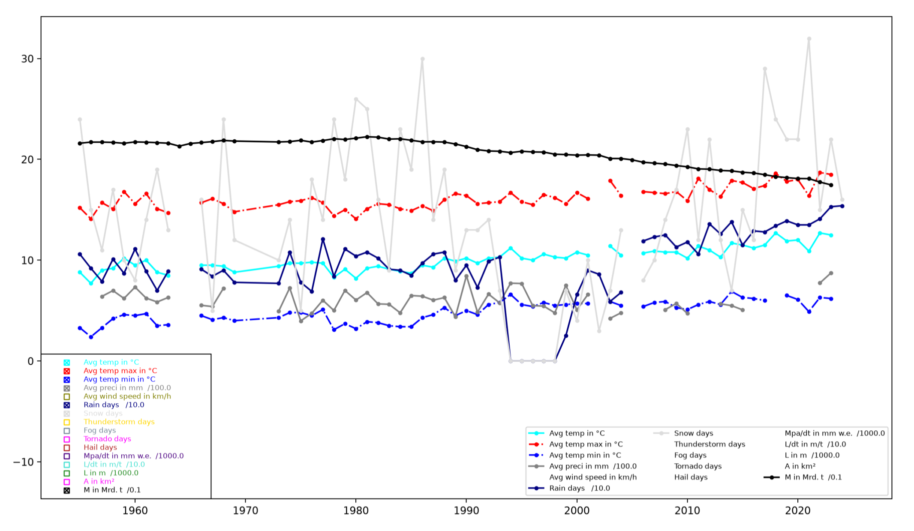
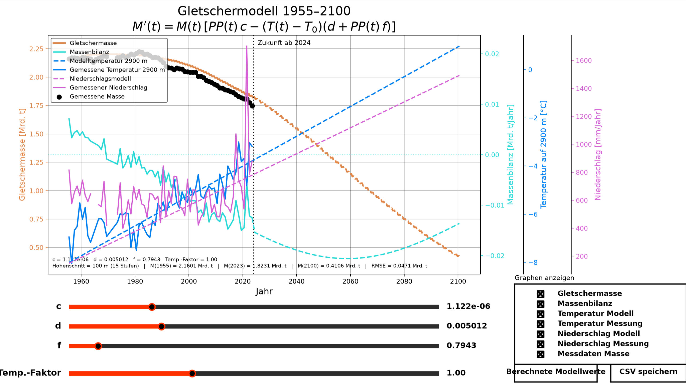
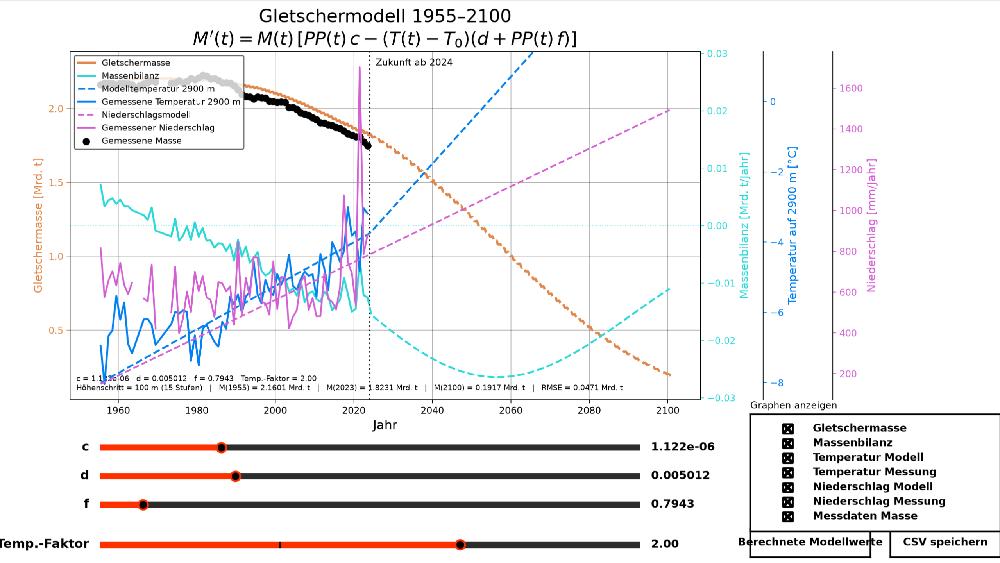

# tl;dr

Im Zuge der Modellierungswoche 2026, einem Projekt des Zentrums für Mathematik, wurde ein Modell entwickelt, welches auf Basis von historischen Wetterdaten einerseits näherungsweise die historische Massenveränderung des Rhonegletschers im Kanton Wallis in der Schweiz nachstellt und im zweiten Schritt mit Prognosen für die zukünfitgen klimatischen Bedingungen auch die zukünftige Massenveränderung des Gletschers aufzeigt. Vorrangig wurde dabei eine Funktion für die Massenveränderung aufgestellt, welche gleich der Differenz der Massenakkumulation (Massenzunahme) des Gletschers und der Massenablation (Massenabnahme) des Gletschers an einem gewissen Zeitpunkt ist. Dabei sind Massenakkumulation und Massenablation Funktionen, die von Niederschlag und Temperatur zu eben diesem Zeitpunkt abhängig sind. Niederschlag und Temperatur sind ihrerseits Funktionen, die sich aus Wetterdatensätzen der letzten 30 Jahre speißen. Zur optimalen Bestimmung der Modellparameter dienten Daten über die tatsächliche historische Massenbilanz des Gletschers. Man fand dabei für die meisten denkbaren Annahmen für das zukünftige klimatische Verhalten ein Sterben des Gletschers bis zum Ende des Jahrhunderts. 

\newpage

\tableofcontents

# Zielsetzung

Der Rhonegletscher ist ein Gletscher in der Südschweiz, von dem bereits seit Mitte des letzten Jahrhunderts Messdaten über Masse und Länge des Gletschers sowie über das Wetter, etwa Niederschlagmenge, Regentage, Temperatur sowie Windstärke und -richtung vorliegen. Unser Ziel liegt nun darin, im ersten Schritt ein Modell zu entwickeln, das die Massenveränderung des Gletschers historisch bestmöglich beschreibt, und dann weiter die Wetterdaten auf Basis von Saisonalitäten und Trends so in die Zukunft zu prognostizieren, auf dass man eine begründete Vermutung über die zukünftige Massenveränderung des Gletschers mittels eben diesem Modell abgeben kann.

\clearpage

# Daten

## Herkunft

Die historischen Daten über die Gletschermassen und -längenänderung stammen von „scnat wissen”, dem Webportal der schweizer Akademie der Wissenschaften, aus einem Bericht der ETH Zürich [@bilanzen]. Die Daten reichen bis 1900 zurück und wurden jährlich erhoben. Zur Überprüfung unserer Modellierung haben wir uns allerdings auf den Erhebungszeitraum zwischen 1955 und 2024 beschränkt.

Mittels eines Web-Scraping-Algorithmus in Python, der die Bibliotheken `requests` und `BeautifulSoup` nutzt, wurden die tagesbezogenen Wetterdaten von einer Wetterstation in Sitten (franz. Sion), einer Stadt im Tal des Gletschers, ermittelt. Sie liegen mehr oder minder kontinuierlich seit dem 1. Januar 1955 vor [@wetterdaten].

## Jahresdaten

Hierbei handelt es sich um alle Daten, die jahresweise erhoben worden sind. Folgende Tabelle zeigt die 

| **Dimension** | **Einheit**                 | **Beschreibung**                      | **Herkunft**                                                                                                                                                                        |
|-----------------|--------------------------|--------------------------------------------------------------|--------------------------------------------|
| **T**         | $^{\circ}C$                        | Temperatur                            | tt (scraped)                                                                                                                                                                        |
| **TM**        | $^{\circ}C$                        | Maximaltemp.                          | tt (scraped)                                                                                                                                                                        |
| **Tm**        | $^{\circ}C$                        | Minimaltemp.                          | tt (scraped)                                                                                                                                                                        |
| **PP**        | $mm$                        | Jahresniederschlag                    | tt (scraped)                                                                                                                                                                        |
| **V**         | $\frac{km}{h}$              | Durchschnittliche Windgeschwindigkeit | tt (scraped)                                                                                                                                                                        |
| **RA**        | -                           | Regentage                             | tt (scraped)                                                                                                                                                                        |
| **SN**        | -                           | Schneetage                            | tt (scraped)                                                                                                                                                                        |
| **TS**        | -                           | Sturmtage                             | tt (scraped)                                                                                                                                                                        |
| **FG**        | -                           | Nebeltage                             | tt (scraped)                                                                                                                                                                        |
| **TN**        | -                           | Tornadotage                           | tt (scraped)                                                                                                                                                                        |
| **GR**        | -                           | Hageltage                             | tt (scraped)                                                                                                                                                                        |
| **MpA/dt**    | $mm\ w.e. = \frac{kg}{m^2}$ | Massenänderung pro Fläche             | na (abgeschrieben)                                                                                                                                                                  |
| **L/dt**      | $m$                         | Längenänderung                        | na (abgeschrieben)                                                                                                                                                                  |
| **L**         | $m$                         | Länge                                 | Hergeleitet aus $\frac{L}{dt}$ und gegebener $Länge\ um\ 1999$ in der Aufgabenstellung (dort ohne Quelle)                                                                           |
| **A**         | km²                         | Fläche                                | Berechnet aus $L$ und fest angenommener $B$                                                                                                                                         |
| **M**         | $Mrd.\ t$                   | Durchschnittliche Masse               | Hergeleitet aus $\frac{MpA}{dt}$ und der $MpA$ um 1999 (diese ist berechnet aus dem in der Aufgabenstellung gegebenem $V$, der durchschnittlichen $Dichte\ \rho\ von\ Eis$ und $A$) |

## Tagesdaten

Hierbei handelt es sich um tagesweise erhobene Wetterdaten. Es wurden keine Daten aus anderen hergeleitet, dementsprechend ist hier weniger Aufwand vonnöten - schlicht das Scraping wurde durchgeführt mit den in diesem Ordner befindlichen Python-Dateien.

| **Dimension** | **Einheit**    | **Beschreibung**                                                            | **Herkunft**          |
|---------------|----------------|-----------------------------------------------------------------------------|-----------------------|
| **Y**         | -              | Jahr                                                                        | tt (scraped)          |
| **M**         | -              | Monat                                                                       | tt (scraped)          |
| **D**         | -              | Tag                                                                         | tt (scraped)          |
| **T**         | $^{\circ}C$           | Durchschnittstemp.                                                          | tt (scraped)          |
| **TM**        | $^{\circ}C$           | Maximale Durchschnittstemp.                                                 | tt (scraped)          |
| **Tm**        | $^{\circ}C$           | Minimale Durchschnittstemp.                                                 | tt (scraped)          |
| **SLP**       | $hPa$          | Luftdruck auf Meereshöhe                                                    | tt (scraped)          |
| **H**         | -            | rel. Luftfeuchte                                                            | tt (scraped)          |
| **PP**        | $mm$           | Niederschlag                                                                | tt (scraped)          |
| **VV**        | $km$           | Durchschnittliche Sicht                                                     | tt (scraped)          |
| **V**         | $\frac{km}{h}$ | Mittelwind                                                                  | tt (scraped)          |
| **VM**        | $\frac{km}{h}$ | Durchschnittlicher anhaltender Wind                                         | tt (scraped)          |
| **VG**        | $\frac{km}{h}$ | Maximale Windgeschwindigkeit                                                | tt (scraped)          |
| **RA**        | -              | Regentage                                                                   | tt (scraped)          |
| **SN**        | -              | Schneetage                                                                  | tt (scraped)          |
| **TS**        | -              | Sturmtage                                                                   | tt (scraped)          |
| **FG**        | -              | Nebeltage                                                                   | tt (scraped)          |
| **t**         | -              | Jahr seit 1955 addiert zur Gleitkommazahl mit Tagen als Quotient durch 366. | Berechnet aus Y, M, D |

## Aufbereitung

Diese Daten müssen nun noch aufbereitet werden. Letztendlich muss hier die Masse für jedes Jahr berechnet werden. Hierfür sind die Massenbilanzen jedes Jahrs in $\text{mm w.e.}=\frac{kg}{m^2}$ gegeben, jedoch fehlt ein Ausgangswert, um absolute Daten aus diesen relativen zu bestimmen.

Ein absoluter Datenpunkt muss also zunächst bestimmt werden. Hierfür benötigt man in unserem vereinfachten Quader-Modell wiederum die Länge, wofür wir die Längenbilanzen $\frac{L(t)}{dt}$ in $m$ gegeben haben. Ausgehend von $9830m$ Länge um das Jahr 1999 in der Aufgabenstellung lassen sich nun rekursiv alle anderen Werte berechnen.

$$L(t+1) = L(t) + \frac{L(t+1)}{dt}$$

Als nächstes berechnet man die Fläche. Gemäß der [Annahmen](#annahmen) ist diese also abhängig von einer Breite $B = const.$ und der Länge $L(t)$. Laut „glamos.ch” betrug die Fläche 2023 rund $13.58km^2$ [@factsheet]. Hieraus lässt sich eine Breite von ca. $1500m$ ableiten, die auch den Rest des Datensatzes recht gut abbildet (wobei bei weiterer zeitlicher Entfernung vom Ausgangspunkt mit absolut verfügbaren Daten die Abweichung größer wird und eine Annäherung mit einer linearen Funktion naheliegt). Nun kann man die Massenbilanz (in $\frac{kg}{m^2}$) in eine tatsächliche Massenzunahme (in $kg$) umwandeln:

$$\text{Massenzunahme in kg} = \text{Massenbilanz in } \frac{kg}{m^2} \cdot B(t) \cdot L(t)$$

Damit kann man nun wiederum rekursiv alle Massen von einem absoluten Startwert aus berechnen. Dieser wurde bestimmt aus dem Volumen $V_{1999} = 2.23km^3$ aus der Aufgabenstellung und der durchschnittlichen Dichte $\rho \approx 918 \frac{kg}{m^3}$ von Wasser.

## Schwächen

Die Wetterstation, die die Daten erhoben hat, liegt etwa 90km südwestlicher Richtung vom Rhonegletscher entfernt. Dadurch ist eine gewisse Abweichung von den tatsächlichen Wetterverhältnissen am Gletscher zu erwarten.

![Das Problem mit der Entfernung [@luftlinie]](assets/luftlinie_klimastation_sion_rhonegletscher.png){width=70%}

Allerdings ist dieser Umstand vernachlässigbar, da die Station und der Gletscher im gleichen Tal liegen und somit etwa den gleichen klimatischen Phänomenen ausgesetzt sind. 

![Die Entfernung ist jedoch im gleichen Tal [@temperatur-rhonetal]](assets/meteoblue.com-2026-10-07_11-38_-_wetterkarte-im-tal.png){width=70%}

Zudem besitzt der ursprüngliche Datensatz teilweise Lücken, die mit interpolierten Daten ausgefüllt werden mussten.

Es ist denkbar, dass eine Annäherung mittels eines metereologischen Modells eines renomierten Instituts bessere Daten liefen würde, als durch die durchaus weit entfernte Wetterstation.

Es ist denkbar, dass eine Annäherung mittels eines metereologischen Modells eines renommierten Instituts bessere Daten liefen würde, als durch die durchaus weit entfernte Wetterstation.

## Visualisierung

Die Abbildung \ref{fig:all_data} zeigt verschiedene der jährlich erhobenen Daten, welche durch Aufbereitung um die Masse erweitert wurden. Hier zeigen sich auch die Datenlücken.

{#fig:all_data}

\clearpage

# Modell

## Annahmen {#annahmen}

Zunächst nehmen wir den Gletscher als Quader mit fixer Breite $B = 1,5km$ an. Daraus folgt eine Abhängigkeit von der Länge $L$ für die Oberfläche $O(t) \propto L(t)$ und die Masse $M(t) \propto L(t)$ des Gletschers. Die Temperatur in der für unser Modell gewählten Standardatmosphäre nimmt alle $100m$ um $0,65^{\circ}C$ ab.

Für die Akkumulation wird davon ausgegangen, dass Niederschlag ab einer Temperatur $T(t) < 2^{\circ}C$ als der Gletschermasse zuträglich gewertet wird. 

Gleichzeitig wird Niederschlag ab einer Temperatur $T(t) > 2^{\circ}C$ als der Masse abträglich (Ablation) gewertet. Dann kann man von einer Temperaturabhängigkeit respektive Temperaturähnlichkeit $A(t) \sim T(t)$ sprechen.

## Temperatur

Betrachtet man den durchschnittlichen jährlichen Temperaturverlauf, also die durchschnittliche Temperatur für einen bestimmten Tag im Jahresverlauf, lässt sich dieser gut durch eine Sinusfunktion modellieren:

$$
T(t) = a \cdot \sin\left(2\pi \cdot \frac{x-c}{b}\right) + d
$$

{width=70%}

Die einzelnen Parameter können dabei wie folgt interpretiert werden:

- $a$ bezeichnet die **Amplitude** in $^{\circ}C$ und beschreibt, wie stark die Temperaturen im Jahresverlauf schwanken.
- $b$ bezeichnet die **Periodendauer** in Tagen. Dieser Wert wird sinnvollerweise auf $365{,}2524$ Tage festgelegt.
- $c$ bezeichnet die **Phasenverschiebung** in Tagen und gibt an, um welchen Betrag der Temperaturverlauf entlang der Zeitachse verschoben ist. Damit lässt sich insbesondere der Zeitpunkt des kältesten bzw. wärmsten Tages bestimmen.
- $d$ bezeichnet den **Temperaturmittelwert** in $^{\circ}C$ und entspricht der vertikalen Verschiebung der Sinuskurve.

Statt den gesamten Messzeitraum durch eine einzige Sinuskurve zu beschreiben, werden die Parameter $a$, $c$ und $d$ nun für jedes Jahr separat bestimmt. Dadurch kann ihre zeitliche Entwicklung analysiert und für die Modellierung zukünftiger Jahre berücksichtigt werden. Die jeweils optimalen Parameter werden dabei programmatisch für jedes Jahr ermittelt und gespeichert.

Beispielhaft sind im Folgenden die ermittelten Parameter und die daraus resultierenden Sinuskurven für die Jahre 1994 und 2023 dargestellt:

{width=70%}

{width=70%}

Auf Grundlage der Parameter $a$, $b$, $c$ und $d$ lässt sich anschließend jeweils eine Regressionsgerade bestimmen. Diese beschreibt die zeitliche Entwicklung der einzelnen Parameter und kann verwendet werden, um den Temperaturverlauf zukünftiger Jahre zu modellieren:

{width=70%}

Die Entwicklung der Parameter lässt sich unter Berücksichtigung ihrer jeweiligen Bedeutung wie folgt interpretieren:

- Die **Amplitude $a$** steigt leicht an. Dies könnte darauf hindeuten, dass die jahreszeitlichen Temperaturschwankungen im betrachteten Zeitraum zunehmen. Ein möglicher Zusammenhang besteht mit zunehmenden Wetterextremen infolge des Klimawandels.
- Die **Periodendauer $b$** wurde bei der Berechnung der Parameter auf den festen Wert $365{,}2524$ Tage gesetzt und bleibt daher konstant.
- Die **Phasenverschiebung $c$** verändert sich nur geringfügig. Dies deutet darauf hin, dass sich der Zeitpunkt der jahreszeitlichen Temperaturminima und -maxima im betrachteten Zeitraum nur wenig verschoben hat. Allerdings ist dieser Zeitpunkt von verschiedenen meteorologischen und klimatischen Faktoren abhängig.
- Beim **Temperaturmittelwert $d$** ist hingegen ein deutlicher Anstieg von etwa $3^{\circ}C$ über den betrachteten Messzeitraum zu erkennen. Dieser Anstieg steht im Einklang mit der allgemeinen Erwärmung im Zuge des Klimawandels.

Um die Genauigkeit der ermittelten Parameter zu bewerten, kann insbesondere der Parameter $d$, der den mittleren Temperaturwert eines Jahres beschreibt, mit den tatsächlich gemessenen Jahresmitteltemperaturen verglichen werden. In der unteren Abbildung stellt man fest, dass die tatsächlichen Werte nahezu identisch zu den modellierten Werten des Paramters $d$ sind.

Darüber hinaus stellt sich die Frage, welcher Zeitraum für die Bestimmung der Regressionsgeraden verwendet werden sollte. Wird der gesamte Messzeitraum betrachtet, ergibt sich eine geringere Steigung der Temperaturentwicklung. Dadurch könnte die aktuelle Erwärmung weniger deutlich abgebildet werden. Ein kürzerer Zeitraum reagiert dagegen stärker auf aktuelle Veränderungen, ist jedoch anfälliger für kurzfristige Schwankungen und einzelne ungewöhnlich warme oder kalte Jahre.

In der folgenden Abbildung sind die Regressionsgeraden für einen Zeitraum ab 2014 sowie für eine 30-jährige Klimaperiode von 1994 bis 2023 dargestellt. Wir haben uns bewusst gegen den kürzeren Zeitraum ab 2014 entschieden, da eine 30-jährige Periode besser geeignet ist, langfristige klimatische Entwicklungen abzubilden und den Einfluss kurzfristiger Schwankungen zu reduzieren.

{width=70%}

Zusammenfassend kann das Programm zur Berechnung der Massenbilanz nun für jeden beliebigen Zeitpunkt eine modellierte Temperatur bestimmen. Dazu wird zunächst der Zeitpunkt innerhalb des Jahres bestimmt und anschließend mit den für das jeweilige Jahr ermittelten Regressionsparametern die entsprechende Temperatur berechnet. Daraus ergibt sich die folgende Funktion:

$$
T(t) = a_{regr}(t) \cdot \sin\left(2\pi \cdot \frac{x-c_{regr}(t)}{b_{regr}(t)}\right) + d_{regr}(t)
$$

Die zugrunde liegenden Messdaten stammen von einer Wetterstation auf einer Höhe von $482m$. Der betrachtete Gletscher beginnt jedoch erst auf einer Höhe von etwa $2200m$, sodass dort von einer deutlich niedrigeren Temperatur auszugehen ist. Um diesen Höhenunterschied im Modell zu berücksichtigen, wird eine Temperaturabnahme von $0{,}65^{\circ}C$ pro $100m$ Höhenzunahme gemäß des Modells der Standardatmosphäre angenommen.

Damit kann aus den Messdaten der Wetterstation eine modellierte Temperaturentwicklung für die Höhe des Gletschers abgeleitet werden. Diese dient anschließend als Grundlage für die weitere Berechnung der Massenbilanz. Abschließen sieht man in der folgenden Abbildung unsere modellierte Temperatur und die tatsächlichen monatlichen Durchschnittwerte.

{width=70%}

## Niederschlag

Beim Niederschlag lässt sich - betrachtet man die Jahresverläufe - zunächst keine Regelmäßigkeit ausmachen.

{width=70%}

Kumuliert man jedoch die Tageswerte monatlich und zeichnet eine Ausgleichsgerade durch diese, erhält man eine Funktion, die den Niederschlag pro Monat in $\frac{mm}{Monat}$ annähert. Da die Daten eine hohe Streuung haben, ist dies für den einzelnen Zeitpunkt jedoch ungenau. Um zu validieren, dass zumindest die Steigung stimmt, kumuliert man nun die Regentage jährlich (da diese eine deutlich geringere Streuung aufweisen) und zeichnet auch hier eine Regressionsgerade. Es zeigt sich eine ähnliche Steigung.

{width=70% #fig:pp_modelliert}

Da die Niederschlagsmenge jedoch die richtige Einheit besitzt und somit genauer ist, fließt diese - wie die pinke Linie in Abbildung \ref{fig:pp_modelliert} zeigt - in unser tatsächliches Modell ein.

\clearpage

## Akkumulation

Der Gletscher wird näherungsweise als Quader beschrieben, der eine feste Breite ($B = 1,5km$) hat und dessen Verhältnis zwischen Höhe und Länge immer gleich ist. Man geht weiter davon aus, dass der Niederschlag gleichmäßig auf die gesamte sichtbare Oberfläche, trifft und all dieser Niederschlag auch gefriert, sofern die Temperaturen auf den entsprechenden Höhen unter $T_0 = 2^{\circ}C$ liegt. Für die Massenzunahme des Gletschers geht man weiter davon aus, dass die gesamte Flächenzunahme auf der Längenzunahme beruht ($\frac{\text{Fläche}}{dt} = l \cdot B \text{, } B = const.$). 

Daraus lässt sich nun mithilfe des Niederschlags $PP(t)$ in der Einheit $\frac{l}{m^2} = mm$ und der sichtbaren Oberfläche des Gletschers ein Volumen berechnen. Dieses kann man nun mit der Dichte $\rho = 1000 \frac{kg}{m^2}$ von Wasser verrechnen und erhält eine Masse:

$$
M = \rho \cdot PP(t) \cdot \text{Fläche}
$$

Wie oben gesagt, nehmen wir eine konstantes Verhältnis zwischen Gletscherhöhe und Gletscherlänge an, welches zunächst von $c$ dargestellt wird. Die Fläche lässt sich aufgrund der Annahme $L \sim M$ folgendermaßen darstellen.

$$\text{Fläche} = B \cdot L(t) \approx c \cdot B \cdot M(t)$$

 Nun lässt sich die Formel für die Zunahmefunktion herleiten.

$$ 
Z(t) =
\begin{cases}
    0 & \text{für } T(t) \ge T_0 \\
    PP(t) \cdot \rho_{Wasser} \cdot c \cdot B \cdot M(t) & \text{für } T(t) < T_0
\end{cases}$$

Alle weiteren konstanten Einflüsse auf die Akkumulation fließen logischerweise - wenn auch ungewollt - mit in den im folgenden optimierten Parameter c in der Einheit $\frac{1}{mm \cdot Jahr}$ mit ein.

## Ablation

Ab einer Temperatur $T_0 = 2^{\circ}C$ schmilzt der Gletscher. Wenn die Temperatur $T(t) > 2^{\circ}C$ und es regnet, wird die Schmelze um einen unbekannten Faktor $f$ in der Einheit $\frac{1}{^{\circ}C \cdot Jahr \cdot mm}$ beschleunigt, da Niederschlag eine bessere Wärmleitung ermöglicht. Beide Effekte sind direkt proportional zur Gletschermasse, da diese, unter unseren Annahmen, wiederum zur Gletscheroberfläche proportional ist und der Niederschlagseffekt auf der gesamten Oberfläche stattfindet. Der allgemeine Temperaturschmelzeffekt ist direkt massenabhängig, da Schmelze idealisiert für jedes Kilo Gletschereis gleichmäßig stattfindet. Der Temperaturgradient des Eises innerhalb des Gletschers, also der geringere Einfluss der Außentemperatur auf Eis, das nicht an der Luft liegt, wird als annähernd linear angenommen und fließt demnach in die Schmelzkonstante $d$ in der Einheit $\frac{1}{^{\circ}C \cdot Jahr}$ ein.

$$
A(t) = 
\begin{cases}
    0 
    & \text{für } T(t) \le 0\\
    M(t) \cdot d \cdot (T(t))
    & \text{für } 0 < T(t) < 2 \\
    M(t) \cdot d \cdot (T(t)) 
    + PP(t) \cdot f \cdot M(t) \cdot (T(t) - T_0) & \text{für } T(t) \ge 2
\end{cases}
$$

## Vernachlässigung

In die derzetige Modellierung fließen bis dato nur die Temperatur und der Niederschlag ein. Dies scheint zwar eine soweit suffiziente Modellierung herzubieten, aber es ist davon auszugehen, dass der Einbezug weiterer Faktoren an dieser Stelle doch eine bessere Abbildung der Realität ermöglichen würde.

So gehen wir wie oben beschrieben von einem geometrischen Ideal des Gletschers aus, in dem die Breite wegen der Berge konstant und ebenso das Verhältnis von Höhe zu Länge des Gletschers konstant ist, was es uns weiter erlaubt eine direkte Proportionalität von Masse und Oberfläche anzunehmen. Dabei werden die realen Gegebenheiten vernachlässigt, eine Ungenauigkeit, die allerdings zumindest im Ansatz durch unsere optimierten Modellparameter abgedeckt werden.

Weiter wird nur der Einfluss der Umgebungstemperatur auf den Schmelzvorgang berücksichtigt, nicht aber der Einfluss der direkten Sonneneinstrahlung, welche durch die thermische Absorption des Schnees den Schmelzvorgang weiter beschleunigen und weiter wohl zur Sublimation, also dem direkten Übergang von Eis zu Wasserdampf, durch das Auflösen etwaiger Wasserstoffbrücken führen würde. Der Vorfaktor der Umgebungstemperatur spiegelt diesen Umstand nur bediengt wieder.

Durch Wind und andere Faktoren wie etwa Lawinen werden Schneemassen, die nicht direkt durch Schneefall auf dem Gletscher entstehen, auf diesen verschoben, aber auch von diesem entfernt. Unter der Erwartung, dass die Verschiebung auf den Gletscher nicht nennenswert größer ist als die Verschiebung von dem Gletscher ab. Vernachlässigt dieses Modell diesen Umstand insofern, dass kein eigener Term dafür auftaucht. Eine Näherung gelingt auch hier vorrangig durch die optimierten Parameter des Modells.

Die Niederschlagsmodellierung, die vorrangig für die Prognostion der zukünftigen Masse des Gletschers nötig ist, nimmt eine Unabhängigkeit von der Temperatur an. Tatsächlich ist allerdings eine proportionale Relation zwischen Temperatur und Niederschlag bekannt, die somit vernachlässigt wird. Somit fließt zwar der grobe Trend, nicht aber die innerjährliche Fluktuation in das Modell ein und auch dieser [der Trend] nur in indirekter Berücksichtigung der veränderlichen Temperaturprognose.

\clearpage

# Fazit

## Implementierung

Mithilfe der Python-Libraries `matplotlib`, `numpy` und `scipy` wurde nun eine Codebasis geschaffen, die die Differentialgleichung (im Folgenden DGL genannt) modelliert. Hierbei können die Parameter $c$, $d$, und $f$ über Schieberegler variiert werden. Auf diese Weise lässt sich die Gleichung numerisch lösen [@git-repo].

Zudem wurde noch ein Algorithmus implementiert, welcher die optimalisierte Kombination aller drei Parameter berechnet, um eine möglichst geringe Varianz des Modells zur Messung zu erhalten. Das Resultat lässt sich in Abbildung \ref{fig:modell_screenshot} begutachten.

{#fig:modell_screenshot}

Zudem gibt es einen Faktor, mit dem die Steigung der Mittellinie der angenäherten Temperatur-Sinuskurve in der Zukunft multipliziert wird. Damit kann man verschiedene zukünftige Szenarien modellieren, wie schon in der Einleitung erwähnt. Dies wird in Abbildung \ref{fig:modell_screenshot_factor2} demonstriert.

{#fig:modell_screenshot_factor2}

\clearpage

## Validierung

Aufgrund von Zeitmangel konnte keine vollständige Validierung des Modells der Daten durch Anwendung der einen Datenhälfte auf das Modell mit für diese optimierten Parametern und anschließende Überprüfung der vorhergesagten Daten mit der anderen Datenhälfte durchgeführt werden. 

Jedoch wurde als Maß für die Modellgüte der RMSE (engl. für root mean squared error) verwendet, welcher die Abweichung zwischen Modell und Messwerten zusammenfasst. Die Modellparameter $c$, $d$ und $f$ wurden im Rahmen der Kalibrierung so bestimmt, dass dieser Fehler möglichst gering ausfällt. Der Vergleich zeigt, dass das Modell den langfristigen Verlauf der Gletschermasse grundsätzlich abbilden kann, kurzfristige Schwankungen jedoch nur eingeschränkt erfasst werden. Dies ist darauf zurückzuführen, dass das Modell eine vereinfachte Darstellung des realen Gletschersystems ist und nicht alle physikalischen Einflussgrößen berücksichtigt. Die Zukunftsergebnisse bis 2100 sind daher als Szenarien unter den verschiedenen Temperaturentwicklungen zu verstehen.

\newpage

# Quellenverzeichnis